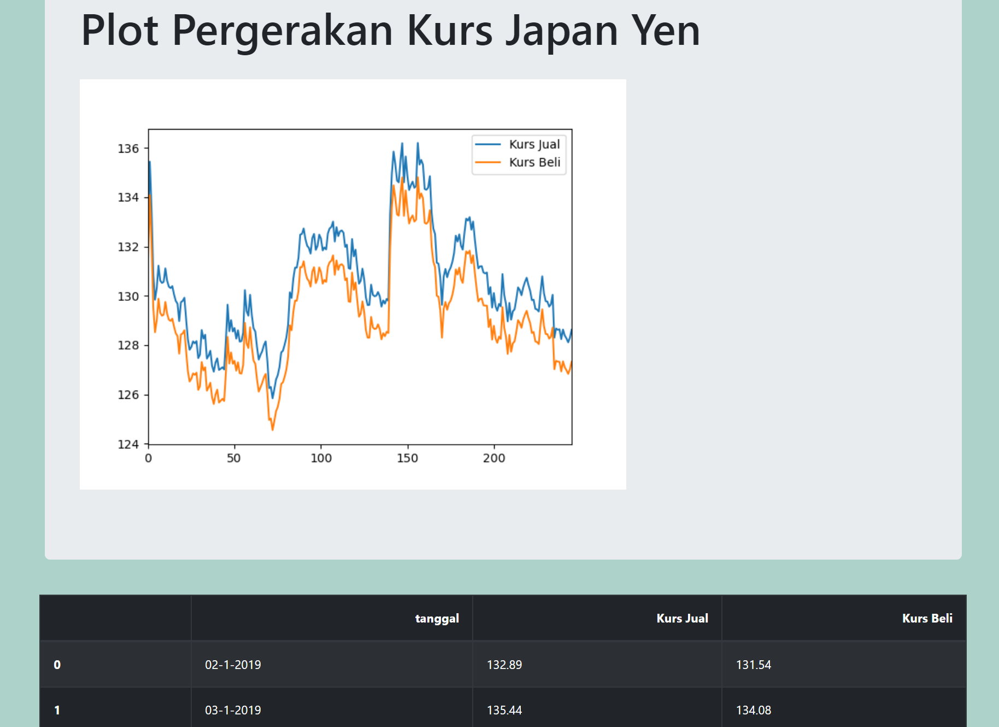

# Web-Scrapping using Beautifulsoup

This project is developed as capstone project from Algoritma Academy Data Analystics Specialization. The deliverables are expected from this project is to do simple web-scrapping , from [Monex News](monexnews.com/kurs-valuta-asing.htm?kurs=JPY), in order to get Japan Yen exchange Rate to Indonesian Rupiah for year 2019. 

## Dependencies

- beautifulSoup4
- pandas
- flask
- matplotlib

## Rubics

- Environment preparation (2 points)
- Finding the right key to scrap the data  & Extracting the right information (6 points)
- Creating data frame & Data wrangling (6 points)
- Implement it on flask dashboard (2 points)

